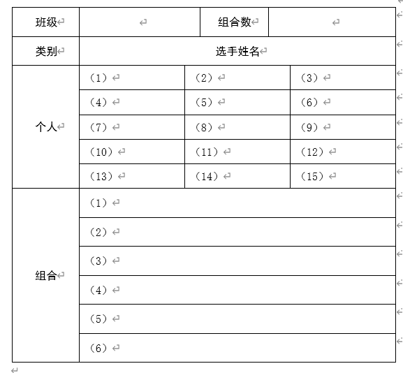

# 江苏省苏州实验中学科技城校学生会文娱部

# 关于举办“巧借天河韵，浅酌太湖音”江苏省苏州实验中学科技城校第四届校园十佳歌手大赛（海选）的通知

### 高一、高二年级各班文娱委员（或班长）、各位同学：

> 为庆祝中国共产党成立一百周年，丰富校园文化生活，展现我校师生团结创新、全面发展的精神风貌，努力营造积极、活跃、优雅的校园文化精神，同时给予同学们一个集中展示自我、收获自信、锻炼自己的舞台，校学生会文娱部将举办“巧借天河韵，浅酌太湖音”江苏省苏州实验中学科技城校第四届校园十佳歌手大赛。现将比赛海选的相关事宜通知如下：

### 一、活动介绍

1、活动宗旨：本次活动秉持“公平、公正、公开”的宗旨，积极促进团队精神养成，提高学生综合素质，弘扬时代精神，激发青春活力，推动学生全面发展。

2、活动主题：巧借天河韵，浅酌太湖音

3、主办单位：江苏省苏州实验中学科技城校学生会文娱部

4、活动对象：高一、高二年级同学，每班不限人数参加。

### 二、活动流程

#### （一）海选报名

1、高一、高二有意向参赛的同学，在本班文娱委员（或班长）处填写本班报名表。

2、报名要求

（1）既可以个人参赛，也可以组合参赛。跨班组合需分别在各班填写报名表，并在报名表上标明班级。

（2）上届获得“十佳歌手”称号的同学本次不参与比赛。

3、各班文娱委员（或班长）于10月29日（周五）12:20前，将本班报名表交给高一3班刘傲雪（高一年级）、高二4班张心琰（高二年级）。逾期视为弃权。

#### （二）海选

1、海选时间：11月3日（周三）中午12:00（高二年级）、12:25（高一年级）

2、海选地点：艺体楼一楼舞蹈房

3、海选形式：各参赛选手/组合准备海选歌曲片段（30秒左右副歌），需要现场清唱。由评委老师根据综合表现选出进入决赛的选手。

4、评委老师：

5、公布决赛名单：进入决赛同学的名单将于11月4日（周四）中午前公布在高一楼二楼公告栏，届时请关注。

6、进入决赛的同学于11月5日（周五）中午12:30至团委办公室冯润玉老师处参加抽签，并加入活动QQ群按时完成相关材料的提交。逾期者将视为弃权处理。

#### （三）决赛结果

决赛将选拔出“校园十佳歌手”，并从中挑选优秀节目参加文艺汇演。

江苏省苏州实验中学教育集团科技城校

学生会文娱部、主席团      

2021年10月3日        

（此件公开发布）

### 附件：

1、第四届校园十佳歌手大赛（海选）报名表

2、十佳歌手大赛评分标准
 

### 附件1：

# “巧借天河韵，浅酌太湖音” 江苏省苏州实验中学科技城校第四届校园十佳歌手大赛 海选报名表

2021.10  

#### 注意事项：

（1）每班参赛人数不限。
（2）既可以个人参赛，也可以组合参赛。跨班组合需分别在各班填写报名表，并在报名表上标明班级。
（3）上届获得“十佳歌手”称号的同学本次不参与比赛。
（4）各班文娱委员（或班长）于10月29日（周五）12:20前，将本班报名表交给高一3班刘傲雪（高一年级）、高二4班张心琰（高二年级）。逾期视为弃权。
 

### 附件2：

# 江苏省苏州实验中学教育集团科技城校 十佳歌手大赛评分标准

评分内容：
1.	演唱技巧（3分），要求整首歌曲的演唱富有情感、蕴含特色、节奏感强、演唱完整。
2.	舞台台风（2分），要求选手在舞台上能收放自如、自然大方。
3.	仪表仪态（2分），要求选手着装大方，符合学生身份，同时又富有青年特有的活力。
4.	歌曲内容（1分），要求参赛曲目内容健康，曲风积极向上。
5.	综合素质（2分），针对参赛选手的舞台表现力。

